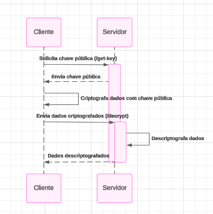

# Example RSA

### Requirements:
1. Install the **Live Server** extension: [Live Server - Visual Studio Marketplace](https://marketplace.visualstudio.com/items?itemName=ritwickdey.LiveServer)

2. Use **Node.js v20.11.0** or higher:  
   If you have `nvm` installed, run:  
   ```bash
   nvm install 20.11.0  
   nvm use 20.11.0
   ```  
   If you don’t have `nvm`, follow this [documentation](https://github.com/nvm-sh/nvm#installing-and-updating).

### Execution:
1. Open the `back-end` folder.

2. Install the dependencies:
   ```bash
   npm install
   ```

3. Generate the key:
   ```bash
   node generate-key.js
   ```

4. Run the server:
   ```bash
   node server.js
   ```

5. With Visual Studio Code open, right-click on `index.html` and select **Open With Live Server**.

6. Now you can verify how it works.

### Diagrams

